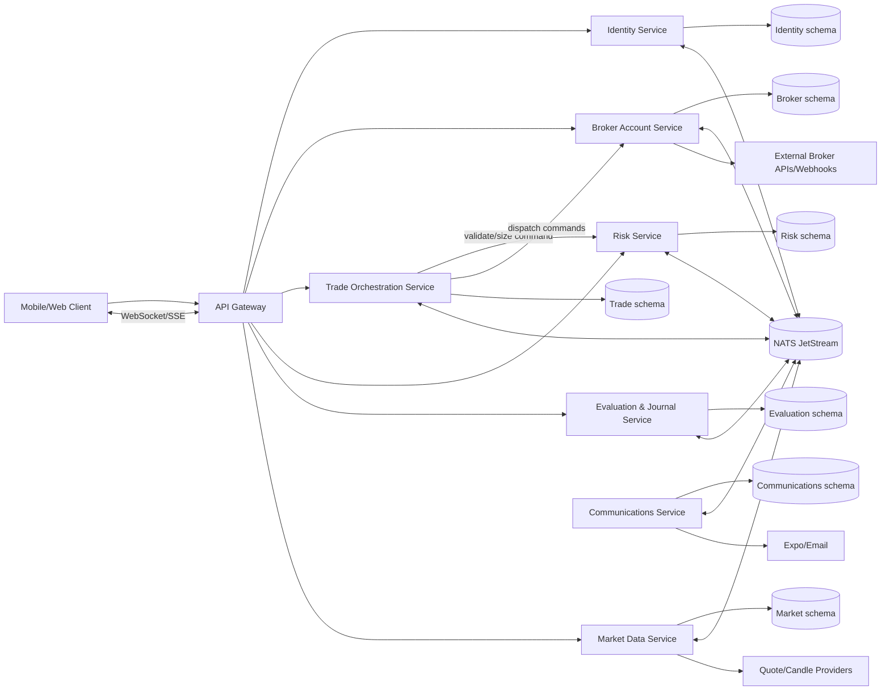
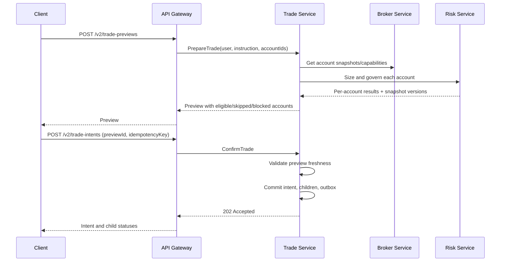
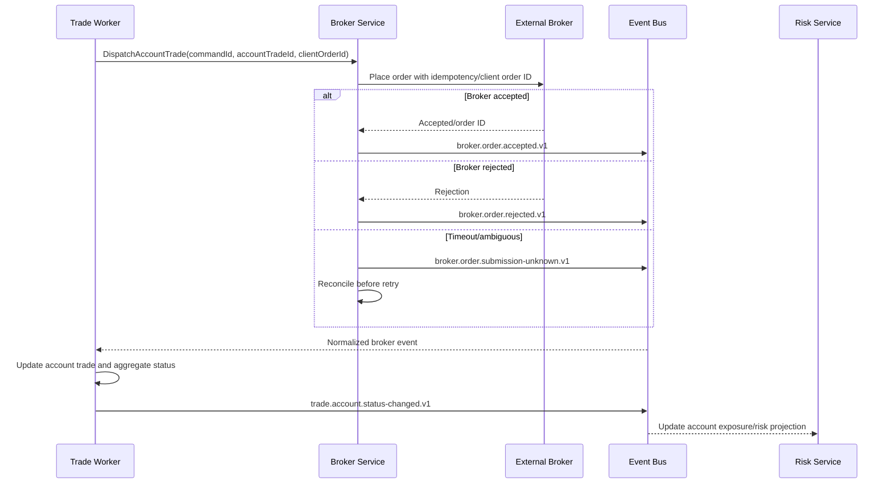

# Technical Requirements and Design: Nx NestJS Microservice Backend and Multi-Broker Architecture

**System:** Zenlot backend  
**Document status:** Proposed  
**Last updated:** 2026-07-26  
**Target framework:** Nx integrated monorepo with NestJS microservices  
**Related product requirements:** [PRD: Multi-Broker Trading with Shared Risk Policies](./PRD_MULTI_BROKER_SHARED_RISK.md)

## 1. Purpose

This document defines:

- the reviewed state of the current Zenlot backend;
- the target Nx NestJS monorepo and microservice architecture;
- the domain and persistence changes needed for multi-broker accounts;
- shared risk-policy behavior with isolated account state;
- one-to-many trade fan-out and account-specific lot sizing;
- service APIs, commands, and domain events;
- security, reliability, observability, and testing requirements; and
- a staged migration that preserves current behavior and production data.

The design intentionally separates the Nx workspace migration from microservice extraction. Nx provides dependency boundaries, build targets, and affected-project tooling; NestJS remains the application and microservice framework. Nx does not itself make code distributed or safe. The existing NestJS application should first be moved intact into the workspace, then decomposed into NestJS services behind verified contracts.

### 1.1 Framework constraint

The target is specifically an **Nx NestJS microservice backend**, not generic Node.js microservices:

- every HTTP API, gateway, domain service, and worker remains a NestJS application;
- the workspace uses `@nx/nest` generators and executors;
- the public gateway remains NestJS with the Fastify platform adapter;
- domain services use Nest modules, dependency injection, configuration, lifecycle hooks, guards, interceptors, and exception filters;
- message-driven services use `@nestjs/microservices` where its transport semantics fit;
- durable JetStream consumers are exposed through Nest providers in the shared event-bus infrastructure library;
- worker processes are Nest standalone applications or Nest microservice applications, depending on whether they consume BullMQ, NATS, or both; and
- pure domain libraries remain framework-independent so their business rules can be tested without bootstrapping Nest.

## 2. Current system review

### 2.1 Repository profile

The reviewed repository is a single NestJS 11 application using:

- Fastify for HTTP;
- Socket.IO gateways for realtime data;
- Prisma 7 and PostgreSQL;
- Redis and BullMQ for asynchronous and scheduled work;
- JWT access and rotating refresh tokens;
- class-validator DTO validation;
- Sentry for errors and tracing;
- Mixpanel for product analytics;
- Expo push, SMTP, and SendGrid communication providers;
- OpenAI and Anthropic coaching providers; and
- external quote and candle providers.

At review time the codebase contains:

- 176 non-test TypeScript files under `src`;
- 80 `*.spec.ts` files across `src` and `test`;
- 18 Prisma models;
- 16 Prisma models with a direct `userId` field;
- no `Account`, `BrokerConnection`, `RiskPolicyAssignment`, `TradeIntent`, or broker-execution model;
- no `accountId` in source, schema, migrations, or tests; and
- eight BullMQ processor flows or queue families spanning trade auto-close, risk coaching, drawdown reset, evaluation coaching, weekly reports, journal reminders, deletion, and price feed.

The full baseline passes:

- 80 Jest suites;
- 571 tests; and
- the production build.

These tests validate the current user-scoped design; they do not validate broker-account isolation.

### 2.2 Current modules

| Current module  | Primary responsibility                                                            | Important dependencies                          |
| --------------- | --------------------------------------------------------------------------------- | ----------------------------------------------- |
| `auth`          | Sign-in, signup, token verification and refresh, global guard                     | user, email, analytics, audit                   |
| `user`          | User profile, password, deletion lifecycle, user gateway                          | Prisma, audit, email, analytics, deletion queue |
| `trade`         | Trade CRUD and local auto-close scanning                                          | quote, risk, evaluation, notifications, BullMQ  |
| `risk`          | Risk profile, sizing, portfolio, drawdown, governance, trade settlement, coaching | quote, evaluation, notifications, audit, BullMQ |
| `evaluation`    | Trading plans, pre/post-trade scoring, behavioral reports, AI coaching            | notifications, BullMQ                           |
| `journal`       | Standalone and trade-linked journal records                                       | Prisma                                          |
| `quote`         | FX quotes, provider failover, user-scoped realtime events                         | auth, external providers                        |
| `candle`        | Candle cache, provider fallback, live candle rooms                                | Prisma, auth, external providers                |
| `price-feed`    | Redis-backed price feed and gateway                                               | quote, auth, BullMQ                             |
| `notifications` | Push tokens, preferences, reminders, notification dispatch                        | BullMQ, Expo                                    |
| `email`         | SMTP/SendGrid email transport and templates                                       | provider configuration                          |
| `feedback`      | Feedback submission, rate limiting, email, audit, analytics                       | deletion Redis queue                            |
| `audit`         | Best-effort audit writes and queries                                              | Prisma                                          |
| `analytics`     | Best-effort Mixpanel events                                                       | Mixpanel                                        |
| `jobs`          | Scheduled deletion worker                                                         | user                                            |

### 2.3 Current persistence assumptions

The present schema encodes one user as the financial account boundary:

- `trade.userId` directly owns all trades.
- `user.accountCurrency` is the only current account currency source.
- `riskProfile.userId` is the primary key, allowing one profile per user.
- `drawdownState.userId` is the primary key, allowing one drawdown state per user.
- `notificationPreference.userId` is the primary key.
- portfolio exposure queries every open trade for a user;
- realized P&L updates the one user-keyed risk profile and drawdown state;
- the current trading-plan constraint allows one active plan per user;
- behavioral reporting queries all evaluated closed trades for a user; and
- realtime trade and coaching events use `user_{userId}` rooms.

The `trade.accountCurrency` field is a calculation snapshot, not an account identity.

### 2.4 Current operational concerns relevant to decomposition

1. One Prisma client owns the entire schema.
2. Modules invoke each other's services in-process.
3. BullMQ queues contain both domain work and scheduling concerns.
4. Socket.IO is process-local unless a Redis adapter is added.
5. Some background jobs scan global tables and then mutate several domains in one database transaction.
6. The trade auto-close worker uses market prices to close local trades; this is not a broker execution or reconciliation flow.
7. OANDA is currently a server-owned candle-data credential, not a user broker connection.
8. The CI workflow comments reference Yarn classic while `package.json` declares Yarn 4.16.0; the Nx migration must resolve this package-manager inconsistency.
9. Production-readiness documentation already identifies missing dead-letter handling, real-database E2E tests, metrics, backup verification, and a Socket.IO Redis adapter.

## 3. Architectural principles

1. **User identity and trading account are different concepts.**
2. **Shared risk policy shares rules, never mutable account state.**
3. **The broker is authoritative for executable order, fill, position, and balance state.**
4. **One user trade instruction produces independently tracked account trades.**
5. **A service owns its writes and schema; other services consume APIs or events.**
6. **No distributed transaction is required to submit to several brokers.**
7. **Durability precedes dispatch:** the canonical intent and account children are committed before workers call brokers.
8. **Internal delivery is at least once; side effects are effectively once through idempotency.**
9. **Synchronous dependencies are minimized on the trade critical path.**
10. **AI, notifications, analytics, and coaching are never critical-path dependencies.**
11. **Contracts are versioned and transport-neutral in shared libraries.**
12. **Extraction is incremental and reversible.**

## 4. Recommended target architecture



### 4.1 Why these service boundaries

The boundaries follow business ownership and failure modes:

- identity and deletion are independent of broker execution;
- broker authentication and reconciliation have provider-specific security and outage behavior;
- trade orchestration owns the fan-out saga and its aggregate status;
- risk policy and financial risk state require deterministic, account-isolated calculations;
- evaluation and journals consume trade outcomes but should not delay execution;
- market data has high read volume and provider-fallback behavior;
- communications is asynchronous and failure-tolerant.

Avoid making every current Nest module a microservice. `feedback`, `audit`, `analytics`, and every queue do not each warrant an independently deployed domain service.

## 5. Nx workspace design

### 5.1 Proposed structure

```text
.
├── apps/
│   ├── api-gateway/                 # NestJS + Fastify
│   ├── identity-service/            # NestJS service
│   ├── broker-service/              # NestJS microservice
│   ├── broker-worker/               # NestJS standalone worker
│   ├── trade-service/               # NestJS microservice
│   ├── trade-worker/                # NestJS standalone worker
│   ├── risk-service/                # NestJS microservice
│   ├── risk-worker/                 # NestJS standalone worker
│   ├── evaluation-service/          # NestJS microservice
│   ├── evaluation-worker/           # NestJS standalone worker
│   ├── market-data-service/         # NestJS microservice
│   ├── market-data-worker/          # NestJS standalone worker
│   ├── communications-service/      # NestJS microservice
│   ├── communications-worker/       # NestJS standalone worker
│   └── legacy-api/                  # existing NestJS app during migration
├── libs/
│   ├── contracts/
│   │   ├── identity/
│   │   ├── broker/
│   │   ├── trade/
│   │   ├── risk/
│   │   ├── evaluation/
│   │   ├── market-data/
│   │   └── communications/
│   ├── domain/
│   │   ├── trade-kernel/
│   │   ├── risk-engine/
│   │   └── evaluation-engine/
│   ├── infrastructure/
│   │   ├── auth/
│   │   ├── config/
│   │   ├── event-bus/
│   │   ├── idempotency/
│   │   ├── observability/
│   │   ├── outbox/
│   │   ├── redis/
│   │   └── testing/
│   └── broker-adapters/
│       ├── core/
│       └── <first-broker>/
├── prisma/
│   ├── identity/
│   ├── broker/
│   ├── trade/
│   ├── risk/
│   ├── evaluation/
│   ├── market-data/
│   └── communications/
├── tools/
├── docs/
├── nx.json
├── tsconfig.base.json
└── package.json
```

Every entry under `apps/` is an Nx-managed NestJS project. Generate service and gateway applications with `@nx/nest:application`. Use `@nx/nest:library` for Nest-specific infrastructure libraries and framework-neutral Nx/TypeScript libraries for pure domain code.

Worker apps are separate NestJS deployment targets but remain within their owning domain. They reuse domain application code and contracts; they are not additional data owners.

### 5.2 Nx project tags and dependency rules

Use tags such as:

- `type:app`
- `type:contract`
- `type:domain`
- `type:infrastructure`
- `scope:identity`
- `scope:broker`
- `scope:trade`
- `scope:risk`
- `scope:evaluation`
- `scope:market`
- `scope:communications`

Enforce with `@nx/enforce-module-boundaries`:

- apps may depend on contracts, their own domain, and approved infrastructure;
- domain libraries may not import NestJS, Prisma, Redis, HTTP, or broker SDKs;
- one domain library may not import another service's persistence or application implementation;
- cross-service compile-time dependencies are limited to versioned contracts;
- broker adapters depend on `broker-adapters/core`, not on trade or risk persistence;
- no application imports from another app.

### 5.3 Build and test targets

Each project should define:

- `lint`;
- `typecheck`;
- `test`;
- `build`;
- `serve`;
- `container`;
- `contract-test` where relevant;
- `e2e` for deployable apps; and
- `migrate` for schema-owning services.

CI should use `nx affected` for ordinary pull requests and run a scheduled or main-branch full matrix. Nx Cloud is optional, not required for correctness.

NestJS application targets should use Nx executors for build and serve. The gateway bootstraps with `NestFactory.create<NestFastifyApplication>()`; message-driven services use `NestFactory.createMicroservice()` or a Nest hybrid application only when they also expose a justified HTTP health/query interface. BullMQ-only workers use `NestFactory.createApplicationContext()` and do not open an unnecessary public HTTP port.

## 6. Service catalog and ownership

All services in this catalog are NestJS applications managed and built by Nx. The boundary descriptions below define data and business ownership; they do not imply different server frameworks.

### 6.1 API Gateway

**Owns**

- public REST and realtime transport;
- request validation at the public boundary;
- JWT verification and request correlation;
- rate limiting;
- response composition that does not require transactional consistency;
- compatibility routes during migration; and
- account-aware WebSocket subscriptions.

**Does not own**

- user records;
- broker credentials;
- trade state;
- risk calculations; or
- domain persistence.

The gateway verifies asymmetric access tokens locally using published identity-service keys. During migration, the current HMAC JWT can remain behind a shared verifier, but the target is asymmetric signing with key rotation and JWKS distribution.

### 6.2 Identity Service

**Owns**

- users;
- passwords and email verification;
- access/refresh token lifecycle;
- roles and entitlements;
- user-level preferences;
- account-deletion orchestration;
- user-level audit identity; and
- feedback ownership metadata.

**Publishes**

- `identity.user.created.v1`;
- `identity.user.updated.v1`;
- `identity.user.deletion-requested.v1`;
- `identity.user.deleted.v1`;
- `identity.entitlement.changed.v1`.

The term `account` in identity analytics and API copy should be changed to `user` or `Zenlot account` to avoid collision with broker trading accounts.

### 6.3 Broker Account Service

**Owns**

- broker provider definitions and capability metadata;
- user broker connections;
- encrypted credential references;
- trading-account discovery;
- trading-account configuration and status;
- broker account snapshots;
- broker webhooks;
- order submission/cancel/close adapter calls;
- broker order/position reconciliation; and
- broker health and rate-limit state.

**Does not own**

- canonical trade intent;
- product risk policies;
- evaluation records; or
- user authentication.

The service accepts account-specific dispatch commands from the trade service and returns or emits normalized broker results. Provider-specific payloads remain inside adapter boundaries or encrypted diagnostic storage.

### 6.4 Trade Orchestration Service

**Owns**

- trade intents;
- targeted account snapshots;
- account trades;
- lot-resolution snapshots received from risk;
- aggregate trade status;
- dispatch attempts;
- normalized execution lifecycle projections;
- idempotency keys for public trade submission; and
- the fan-out/close/cancel saga.

**Publishes**

- `trade.intent.accepted.v1`;
- `trade.account.prepared.v1`;
- `trade.account.dispatch-requested.v1`;
- `trade.account.accepted.v1`;
- `trade.account.filled.v1`;
- `trade.account.rejected.v1`;
- `trade.account.submission-unknown.v1`;
- `trade.account.closed.v1`;
- `trade.intent.status-changed.v1`.

The trade service must not store raw broker credentials or call market-data providers directly.

### 6.5 Risk Service

**Owns**

- reusable risk policies and immutable policy versions;
- account-to-policy assignments;
- account risk state;
- account-specific exposure projection;
- drawdown and circuit-breaker state;
- deterministic position sizing;
- governance results and override acknowledgments; and
- risk-state reconciliation from broker/account trade events.

**Publishes**

- `risk.policy.created.v1`;
- `risk.policy.versioned.v1`;
- `risk.policy.assigned.v1`;
- `risk.account-state.updated.v1`;
- `risk.governance.evaluated.v1`;
- `risk.drawdown-breached.v1`;
- `risk.drawdown-reset.v1`.

The current pure functions in `src/risk/engine` should become `libs/domain/risk-engine` with no NestJS or Prisma imports.

### 6.6 Evaluation and Journal Service

**Owns**

- journals;
- trading plans and plan versions;
- pre-trade checklists and evaluations;
- post-trade execution grades and verdicts;
- behavioral reports;
- evaluation entitlements at the application boundary; and
- AI coaching jobs and outputs.

Account and trade identifiers are references, not foreign keys to another service database. Event handlers maintain local projections needed for reports.

The current pure functions in `src/evaluation/engine` should become `libs/domain/evaluation-engine`.

### 6.7 Market Data Service

**Owns**

- quotes;
- FX conversion rates;
- candle cache;
- provider fallback and budgets;
- market-data subscriptions; and
- price-feed distribution.

OANDA candle credentials remain platform market-data credentials. User broker credentials must never be reused for this service.

### 6.8 Communications Service

**Owns**

- push tokens;
- notification preferences;
- notification delivery attempts;
- email dispatch;
- templates and localized copy; and
- reminder scheduling.

It consumes domain events and must not synchronously block source services.

### 6.9 Audit and analytics

Audit events should be emitted by every domain using a common contract and collected into an append-oriented audit projection. Product analytics can consume sanitized events. Neither may be a critical dependency for a domain write.

Initially, the audit projection can live with identity or communications/platform infrastructure. It should not be directly written by every service into one shared Prisma model indefinitely.

## 7. Persistence strategy

### 7.1 Initial topology

Use one PostgreSQL cluster with a distinct PostgreSQL schema and Prisma client per owning service:

- `identity`;
- `broker`;
- `trade`;
- `risk`;
- `evaluation`;
- `market_data`; and
- `communications`.

Rules:

- each service has separate database credentials restricted to its schema;
- migrations are owned and deployed per service;
- services do not write or join across schemas;
- foreign service IDs are stored as opaque UUIDs without cross-schema foreign keys;
- read models are populated from events or explicit APIs; and
- moving a service to a separate database later must not require domain redesign.

This topology reduces migration risk without pretending the schemas are one shared database.

### 7.2 Transactional outbox and inbox

Every schema-owning service requires:

```text
outbox_event
- id
- aggregate_type
- aggregate_id
- event_type
- event_version
- payload
- correlation_id
- causation_id
- occurred_at
- published_at
- attempts

inbox_message
- consumer
- message_id
- received_at
- processed_at
- result
UNIQUE (consumer, message_id)
```

Domain state and its outbox record are committed in one local transaction. Consumers insert the inbox identity before applying an event so redelivery is safe.

### 7.3 Event transport

Recommended baseline:

- **NATS JetStream** for durable cross-service domain events and commands;
- **BullMQ** inside a service for delayed work, recurring schedules, bounded retries, and provider-specific worker concurrency; and
- HTTP for public APIs and limited internal query APIs where an immediate answer is required.

`@nestjs/microservices` may provide NATS request/reply and non-durable message patterns. Durable domain events must use explicit JetStream publish, acknowledgment, consumer, and redelivery semantics through `libs/infrastructure/event-bus`; the design must not assume that Nest's core NATS transport automatically provides JetStream durability.

Do not use Socket.IO, BullMQ job payloads, or database polling as the cross-service domain event contract.

## 8. Core domain model

The following is conceptual. Each model belongs to the service named in parentheses.

### 8.1 Broker connection and account

```text
BrokerConnection (broker)
- id: UUID
- userId: UUID
- broker: BrokerCode
- environment: LIVE | PRACTICE | DEMO | PROP
- status: PENDING | ACTIVE | REAUTH_REQUIRED | DEGRADED | DISABLED | DISCONNECTED
- externalPrincipalHash: string?
- credentialRef: string
- credentialKeyVersion: string
- connectedAt: timestamp
- lastHealthyAt: timestamp?
- lastSyncAt: timestamp?
- disabledAt: timestamp?
- createdAt / updatedAt

TradingAccount (broker)
- id: UUID
- connectionId: UUID
- userId: UUID
- brokerAccountIdCiphertext: string
- brokerAccountFingerprint: string
- displayName: string
- accountType: LIVE | PRACTICE | DEMO | PROP
- currency: ISO-4217 string
- status: ACTIVE | READ_ONLY | STALE | DISABLED | CLOSED
- fanoutEnabled: boolean
- lotSizingMode: FIXED | RISK_BASED | MULTIPLIER
- defaultLotSize: decimal?
- lotMultiplier: decimal
- minLot / maxLot / lotStep: decimal?
- lastSyncAt: timestamp?
- createdAt / updatedAt

AccountSnapshot (broker)
- id: UUID
- tradingAccountId: UUID
- balance: decimal
- equity: decimal
- marginUsed: decimal?
- marginAvailable: decimal?
- currency: string
- brokerAsOf: timestamp
- observedAt: timestamp
- source: WEBHOOK | POLL | ORDER_EVENT
```

Constraints:

- unique `(connectionId, brokerAccountFingerprint)`;
- `lotMultiplier > 0`;
- fixed mode requires a positive `defaultLotSize`;
- account and connection `userId` must match; and
- external broker account IDs are masked or encrypted at rest.

### 8.2 Shared risk policy and isolated state

```text
RiskPolicy (risk)
- id: UUID
- userId: UUID
- name: string
- status: ACTIVE | ARCHIVED
- currentVersion: integer
- createdAt / updatedAt

RiskPolicyVersion (risk)
- id: UUID
- policyId: UUID
- version: integer
- maxRiskPerTradePct
- maxPortfolioExposurePct
- maxDailyDrawdownPct
- maxWeeklyDrawdownPct
- maxMonthlyDrawdownPct
- maxOpenTrades
- maxCorrelatedExposure
- overrideMode
- createdAt
UNIQUE (policyId, version)

RiskPolicyAssignment (risk)
- id: UUID
- userId: UUID
- tradingAccountId: UUID
- policyId: UUID
- assignedAt
- endedAt?
UNIQUE active assignment per tradingAccountId

AccountRiskState (risk)
- tradingAccountId: UUID PRIMARY KEY
- userId: UUID
- accountCurrency: string
- accountBalance: decimal
- equity: decimal?
- peakBalance: decimal
- dailyOpenBalance: decimal
- weeklyOpenBalance: decimal
- monthlyOpenBalance: decimal
- dailyDrawdownPct
- weeklyDrawdownPct
- monthlyDrawdownPct
- allTimeDrawdownPct
- dailyBreached
- weeklyBreached
- monthlyBreached
- lastResetLocalDate
- sourceAsOf
- stateVersion
- updatedAt

AccountExposureProjection (risk)
- tradingAccountId: UUID
- accountTradeId: UUID
- symbol
- direction
- capitalExposure
- capitalExposurePct
- lifecycleStatus
- eventVersion
```

The shared policy contains no balance or drawdown fields. Two accounts assigned to the same policy have two `AccountRiskState` records and two exposure projections.

### 8.3 Trade intent and account trades

```text
TradeIntent (trade)
- id: UUID
- userId: UUID
- idempotencyKey: string
- symbol: string
- side: BUY | SELL
- orderType: MARKET | LIMIT | STOP
- requestedEntry: decimal?
- stopLoss: decimal
- takeProfit: decimal?
- baseLot: decimal?
- status: TradeIntentStatus
- journalRef: UUID?
- createdAt / confirmedAt / updatedAt
UNIQUE (userId, idempotencyKey)

TradeTargetSnapshot (trade)
- id: UUID
- tradeIntentId: UUID
- tradingAccountId: UUID
- broker: BrokerCode
- accountDisplayName: string
- accountCurrency: string
- riskPolicyId: UUID
- riskPolicyVersion: integer
- lotSizingMode
- accountStateAsOf
- eligibilityStatus
- eligibilityReason?
UNIQUE (tradeIntentId, tradingAccountId)

AccountTrade (trade)
- id: UUID
- tradeIntentId: UUID
- userId: UUID
- tradingAccountId: UUID
- status: AccountTradeStatus
- requestedLot: decimal?
- resolvedLot: decimal
- riskAmount: decimal?
- riskPct: decimal?
- sizingSnapshot: json
- governanceSnapshot: json
- brokerClientOrderId: string
- brokerOrderId: string?
- brokerPositionId: string?
- requestedPrice: decimal?
- averageFillPrice: decimal?
- filledQuantity: decimal?
- closePrice: decimal?
- realizedPnl: decimal?
- accountCurrency: string
- lastBrokerSequence: string?
- lastBrokerAsOf: timestamp?
- failureCode: string?
- failureMessage: string?
- createdAt / submittedAt / filledAt / closedAt / updatedAt
UNIQUE (tradeIntentId, tradingAccountId)
UNIQUE (tradingAccountId, brokerClientOrderId)

DispatchAttempt (trade)
- id: UUID
- accountTradeId: UUID
- attempt: integer
- requestFingerprint: string
- status
- startedAt / completedAt
- normalizedResponseCode
- diagnosticRef?
UNIQUE (accountTradeId, attempt)
```

Provider-specific raw payloads should not be placed in public models or general events. If retained for support, encrypt them, apply a short retention period, and reference them through `diagnosticRef`.

## 9. Risk semantics

### 9.1 Shared policy

For accounts `A` and `B` assigned to policy `P`:

```text
calculation(A) = P.rules + A.riskState + A.exposure + trade geometry
calculation(B) = P.rules + B.riskState + B.exposure + trade geometry
```

No term from `A.riskState` or `A.exposure` participates in `calculation(B)`.

### 9.2 Policy versioning

- Editing a policy creates `RiskPolicyVersion(n + 1)`.
- Active assignments point to the policy, whose current version is used for new previews.
- A prepared account trade stores the exact policy version and calculation inputs.
- A material state or policy-version change between preview and confirmation invalidates or recalculates that account preview.
- Historical account trades are never silently recalculated.

### 9.3 Account state source

With broker integration, broker snapshots replace the current assumption that local realized P&L is the only balance source.

Rules:

- broker balance/equity is authoritative;
- fill/close events may update a fast local projection;
- periodic reconciliation heals missed events;
- state includes `sourceAsOf` and monotonic `stateVersion`;
- stale state blocks risk-based sizing after a configurable threshold;
- manual balance is allowed only for synthetic/manual accounts; and
- a broker correction produces an audit event rather than rewriting history invisibly.

### 9.4 Circuit-breaker resets

Reset scheduling remains based on the owning user's IANA timezone unless the product later adds account-specific timezones. The scheduler emits one account-specific reset command. The idempotency key is:

```text
<tradingAccountId>:<localDate>:<period>
```

### 9.5 Lot-resolution algorithm

For every targeted account:

1. Load the account configuration and current broker capability constraints.
2. Load the active risk-policy assignment and current policy version.
3. Load account risk state and exposure projection.
4. Reject stale or missing state when required by the sizing mode.
5. Resolve the raw lot:
   - `fixed`: `defaultLotSize` or permitted account override;
   - `risk_based`: deterministic risk-engine result;
   - `multiplier`: `tradeIntent.baseLot * account.lotMultiplier`.
6. Normalize to broker lot step using a defined round-down strategy.
7. Validate minimum, maximum, margin, and instrument capability.
8. Evaluate governance for this account.
9. Persist an immutable sizing and policy snapshot.

Decimal arithmetic must be used for money, prices, and quantities at service boundaries and persistence. JavaScript `number` may remain inside proven pure calculations only when precision bounds are documented and tests demonstrate safety.

## 10. Trade fan-out workflow

### 10.1 Preparation and confirmation



Preview records require a short expiration. Confirmation must not accept a preview after policy, account configuration, broker capability, or account state changes beyond allowed tolerances.

### 10.2 Dispatch



### 10.3 Partial success

Fan-out is a saga, not a distributed transaction:

- successful broker orders remain successful;
- rejected accounts remain rejected unless the user submits a new action;
- unknown accounts reconcile before retry;
- retry policy is account- and error-class-specific;
- the parent derives `partially_active` or another aggregate state; and
- compensating cancellation across successful accounts is never automatic unless the user explicitly requests an all-or-cancel workflow in a future feature.

## 11. Account-trade state machine

Recommended account-trade states:

```text
DRAFT
  -> PREPARED
  -> DISPATCH_QUEUED
  -> SUBMITTING
  -> ACCEPTED
  -> PARTIALLY_FILLED
  -> FILLED
  -> CLOSING
  -> CLOSED

PREPARED/DISPATCH_QUEUED/SUBMITTING
  -> SKIPPED
  -> REJECTED
  -> SUBMISSION_UNKNOWN
  -> CANCELLED

ACCEPTED/PARTIALLY_FILLED/FILLED
  -> CANCEL_PENDING
  -> CANCELLED
  -> CLOSING
  -> CLOSED
```

Transitions require:

- expected current state;
- source event identity;
- broker ordering/sequence protection where available;
- an append-only transition record; and
- an outbox event.

Late broker events must not regress a terminal state. Ambiguous conflicts enter `RECONCILIATION_REQUIRED`.

## 12. Broker adapter contract

Every adapter implements a capability-driven interface similar to:

```ts
interface BrokerAdapter {
  readonly broker: BrokerCode;

  connect(input: ConnectInput): Promise<ConnectionResult>;
  refreshConnection(connection: CredentialHandle): Promise<ConnectionHealth>;
  listAccounts(connection: CredentialHandle): Promise<BrokerAccount[]>;
  getAccountSnapshot(account: BrokerAccountHandle): Promise<AccountSnapshot>;
  getCapabilities(account: BrokerAccountHandle): Promise<BrokerCapabilities>;
  placeOrder(input: PlaceOrderInput): Promise<PlaceOrderResult>;
  getOrder(input: GetOrderInput): Promise<BrokerOrder>;
  cancelOrder(input: CancelOrderInput): Promise<BrokerOrder>;
  closePosition(input: ClosePositionInput): Promise<BrokerPosition>;
  listOpenOrders(account: BrokerAccountHandle): Promise<BrokerOrder[]>;
  listOpenPositions(account: BrokerAccountHandle): Promise<BrokerPosition[]>;
  normalizeWebhook(input: VerifiedWebhook): Promise<BrokerDomainEvent[]>;
}
```

Requirements:

- adapters receive credential handles, not database entities;
- normalized types use decimal strings and UTC timestamps;
- capabilities declare supported instruments, order types, lot constraints, client-order IDs, webhook coverage, and rate limits;
- error normalization separates retryable, terminal, authentication, throttling, and ambiguous outcomes;
- adapter tests use recorded/redacted fixtures and broker sandbox contract tests;
- one adapter cannot leak provider types into trade/risk contracts; and
- provider rate limiting and circuit breaking occur inside the broker service.

## 13. Public API design

All IDs are UUID strings. Public routes are user-authenticated; ownership is resolved server-side.

### 13.1 Broker and account routes

```text
GET    /v2/brokers
POST   /v2/broker-connections
GET    /v2/broker-connections
GET    /v2/broker-connections/:connectionId
POST   /v2/broker-connections/:connectionId/refresh
POST   /v2/broker-connections/:connectionId/reauthorize
PATCH  /v2/broker-connections/:connectionId
DELETE /v2/broker-connections/:connectionId

GET    /v2/trading-accounts
GET    /v2/trading-accounts/:accountId
PATCH  /v2/trading-accounts/:accountId
POST   /v2/trading-accounts/:accountId/sync
```

### 13.2 Risk-policy routes

```text
POST   /v2/risk-policies
GET    /v2/risk-policies
GET    /v2/risk-policies/:policyId
PATCH  /v2/risk-policies/:policyId
POST   /v2/risk-policies/:policyId/duplicate
POST   /v2/risk-policies/:policyId/archive
PUT    /v2/trading-accounts/:accountId/risk-policy
GET    /v2/trading-accounts/:accountId/risk-state
GET    /v2/trading-accounts/:accountId/portfolio
GET    /v2/trading-accounts/:accountId/drawdown
```

### 13.3 Trade routes

```text
POST   /v2/trade-previews
POST   /v2/trade-intents
GET    /v2/trade-intents
GET    /v2/trade-intents/:intentId
POST   /v2/trade-intents/:intentId/retry
POST   /v2/trade-intents/:intentId/close
POST   /v2/account-trades/:accountTradeId/cancel
POST   /v2/account-trades/:accountTradeId/close
GET    /v2/account-trades/:accountTradeId/transitions
```

`POST /v2/trade-intents` requires an `Idempotency-Key` header and returns `202 Accepted` after durable persistence, not after every broker acknowledges.

### 13.4 Compatibility

Existing `/trade`, `/risk`, `/journal`, and `/evaluation` routes remain behind the gateway during migration. Compatibility handlers map an existing user to the migrated default account. New multi-account functionality is available only through `/v2`.

## 14. Internal contracts

### 14.1 Event envelope

```json
{
  "messageId": "uuid",
  "type": "trade.account.filled.v1",
  "version": 1,
  "occurredAt": "2026-07-26T22:00:00.000Z",
  "producer": "trade-service",
  "correlationId": "uuid",
  "causationId": "uuid",
  "userId": "uuid",
  "aggregateId": "uuid",
  "payload": {}
}
```

Rules:

- `messageId` is globally unique.
- Event types include an explicit major version.
- Existing fields are not reinterpreted.
- Additive optional changes can remain in the same version.
- Breaking changes create a new event version and coexist during migration.
- Credentials, raw tokens, and unredacted broker payloads are forbidden.

### 14.2 Essential cross-service events

| Event                                  | Producer   | Principal consumers              |
| -------------------------------------- | ---------- | -------------------------------- |
| `broker.account.discovered.v1`         | broker     | risk, gateway projections        |
| `broker.account.snapshot-updated.v1`   | broker     | risk, trade                      |
| `broker.connection.reauth-required.v1` | broker     | communications, gateway          |
| `broker.order.accepted.v1`             | broker     | trade                            |
| `broker.order.filled.v1`               | broker     | trade, risk, evaluation          |
| `broker.order.rejected.v1`             | broker     | trade, communications            |
| `broker.position.closed.v1`            | broker     | trade, risk, evaluation          |
| `trade.intent.accepted.v1`             | trade      | evaluation, analytics            |
| `trade.account.prepared.v1`            | trade      | audit                            |
| `trade.account.status-changed.v1`      | trade      | risk, evaluation, communications |
| `risk.policy.assigned.v1`              | risk       | trade/gateway projections        |
| `risk.drawdown-breached.v1`            | risk       | communications                   |
| `evaluation.coaching-ready.v1`         | evaluation | communications, gateway          |
| `identity.user.deletion-requested.v1`  | identity   | every data-owning service        |

## 15. Authentication and authorization

### 15.1 User identity

The access token identifies the Zenlot user and roles. It does not contain a mutable "active account" claim. Account selection is explicit in route parameters or request payloads, preventing stale tokens from retaining removed account access.

### 15.2 Ownership checks

At every boundary:

1. gateway verifies the token;
2. the owning service verifies the resource's `userId`;
3. command payload user IDs are treated as context, not proof;
4. cross-service calls use workload identity and carry the end-user context; and
5. administrative access is explicit and audited.

Use a shared authorization contract but keep resource decisions in the owning service.

### 15.3 Service authentication

Use mutual TLS or platform workload identity for service-to-service communication. NATS subjects and database credentials are restricted by service. Do not use the public user JWT as the only internal service credential.

## 16. Secrets and broker credential handling

- Store raw broker secrets in a managed secrets store when feasible.
- Otherwise use envelope encryption with a managed KMS key and per-record data keys.
- Persist only `credentialRef`, key version, and safe metadata in ordinary tables.
- Decrypt only inside the broker worker immediately before provider calls.
- Never place decrypted credentials in events, BullMQ, logs, Sentry, analytics, or traces.
- Redact authorization headers and broker account identifiers.
- Support key rotation and connection re-encryption.
- Revoke provider authorization on disconnect where supported.
- Separate platform market-data credentials from user broker credentials.

## 17. Idempotency and consistency

### 17.1 Public submission

`(userId, idempotencyKey)` uniquely identifies a trade intent. Repeating the same key:

- with the same canonical payload returns the existing intent;
- with a different payload returns `409 Conflict`.

Store a canonical payload hash.

### 17.2 Account trade

`(tradeIntentId, tradingAccountId)` is unique. The broker client-order ID is derived from the account-trade ID and remains stable across retries.

### 17.3 Broker ambiguity

If the provider call times out after submission:

1. mark `SUBMISSION_UNKNOWN`;
2. query the broker by client-order ID or reconcile open orders;
3. accept the discovered broker order if it matches;
4. retry placement only when nonexistence is proven; and
5. alert operations when the adapter cannot disambiguate.

### 17.4 Event consumers

Consumers use inbox deduplication and optimistic aggregate versions. Event handlers must be safe under duplication and reordering.

## 18. Background work and scheduling

| Work                                   | Owner                              | Mechanism                                 |
| -------------------------------------- | ---------------------------------- | ----------------------------------------- |
| Account discovery and snapshot polling | broker worker                      | BullMQ repeatable jobs                    |
| Broker order reconciliation            | broker worker                      | delayed/repeatable jobs                   |
| Account trade dispatch                 | trade worker                       | BullMQ, broker/account concurrency limits |
| Drawdown reset                         | risk worker                        | account-specific scheduled commands       |
| Risk coaching                          | risk worker                        | BullMQ, non-critical                      |
| Evaluation coaching                    | evaluation worker                  | BullMQ, non-critical                      |
| Weekly behavioral reports              | evaluation worker                  | BullMQ                                    |
| Journal reminders                      | communications worker              | BullMQ                                    |
| User deletion orchestration            | identity worker plus domain events | saga with completion tracking             |
| Candle gap fill and provider refresh   | market worker                      | BullMQ                                    |

Every queue must define:

- job ID/idempotency key;
- retry count and exponential backoff;
- retryable error classification;
- timeout;
- concurrency;
- dead-letter or failed-job handling;
- retention;
- metrics and alerts; and
- a replay/runbook procedure.

## 19. Realtime delivery

The gateway owns client realtime connections. Domain services publish events; they do not hold client sockets.

Recommended rooms/topics:

```text
user:<userId>
user:<userId>:account:<accountId>
user:<userId>:intent:<tradeIntentId>
market:<symbol>:<timeframe>
```

Requirements:

- authorize subscriptions on join;
- use a Redis Socket.IO adapter or an external realtime gateway before horizontal scaling;
- include event IDs and aggregate versions so clients can deduplicate;
- provide REST catch-up after reconnect;
- do not expose events from another user's account; and
- keep market-data fan-out separate from private account events.

## 20. Changes to current behavior

### 20.1 Trade auto-close

The current `TradeAutoCloseService` scans locally open trades, compares market prices, and settles P&L into user-level state. For broker-integrated accounts:

- stop loss and take profit should be submitted to the broker when supported;
- broker order/position events determine actual closure;
- the backend reconciles missed broker events;
- local market data may trigger alerts or an explicitly designed fallback, but must not claim a broker position closed without broker confirmation; and
- P&L comes from broker fills or a clearly labelled projection until reconciled.

The legacy auto-close path can remain only for synthetic/manual accounts during migration.

### 20.2 Risk balance updates

The current local increment/decrement of `riskProfile.accountBalance` on trade close becomes a projection optimization. Broker snapshots periodically replace or reconcile the account's risk state.

### 20.3 Trading plans and policies

`tradingPlan` remains strategy/evaluation configuration. `RiskPolicy` is a separate financial governance concept. Product decisions may later make trading plans user-wide or account-specific; the migration must not merge these objects.

### 20.4 Notifications

Push tokens and preferences remain user-scoped. Trade and risk notification payloads gain `tradingAccountId`, safe account display name, and `tradeIntentId`.

## 21. Current-to-target code mapping

| Current location                                       | Target                                                                                     |
| ------------------------------------------------------ | ------------------------------------------------------------------------------------------ |
| `src/auth`, auth portions of `src/user`                | `apps/identity-service` and identity libs                                                  |
| user profile/deletion                                  | identity service/worker                                                                    |
| `src/trade` CRUD                                       | trade service                                                                              |
| `src/trade/trade-auto-close*`                          | legacy synthetic-account worker; broker reconciliation replaces it for integrated accounts |
| `src/risk/engine`                                      | `libs/domain/risk-engine`                                                                  |
| risk persistence/services                              | risk service/worker                                                                        |
| trade creation currently inside risk `TradeLogService` | trade orchestration; risk returns decisions, not trade persistence                         |
| `src/evaluation/engine`                                | `libs/domain/evaluation-engine`                                                            |
| evaluation persistence/coaching                        | evaluation service/worker                                                                  |
| `src/journal`                                          | evaluation and journal service                                                             |
| `src/quote`, `src/candle`, `src/price-feed`            | market-data service/worker                                                                 |
| `src/notifications`, `src/email`                       | communications service/worker                                                              |
| `src/audit`                                            | shared audit contract and audit projection                                                 |
| `src/analytics`                                        | sanitized event consumer/platform adapter                                                  |
| `src/feedback`                                         | identity/support API plus communications event                                             |
| root `PrismaService`                                   | one Prisma client per service schema                                                       |
| root `AppModule`                                       | temporary `legacy-api`, then gateway plus service apps                                     |

## 22. Migration plan

### Phase 0: Safety baseline

- Preserve the current passing unit/build baseline.
- Add real PostgreSQL and Redis E2E tests.
- Add queue failure and idempotency tests.
- Inventory public API consumers and WebSocket events.
- Establish production backup and restore verification.
- Resolve Yarn version inconsistency in package metadata and CI.
- Add metrics for current queues and trade settlement before changing behavior.

**Exit:** baseline behavior and production recovery are measurable.

### Phase 1: Nx workspace without behavior changes

- Initialize Nx around the existing repository.
- Add `@nx/nest` and `@nestjs/microservices` as the standard workspace application and transport tooling.
- Move the current application to `apps/legacy-api`.
- Preserve its NestJS/Fastify bootstrap and module behavior.
- Move pure engines into buildable/testable libraries.
- Add project tags and dependency constraints.
- Preserve existing scripts through Nx targets.
- Containerize and deploy `legacy-api` with no API change.

**Rollback:** deploy the pre-Nx artifact.  
**Exit:** behavior, schema, tests, and routes remain equivalent.

### Phase 2: Account and shared-policy model inside the legacy deployment

- Add broker-neutral `TradingAccount`, `RiskPolicy`, versions, assignments, and account risk state.
- Create one `manual` default account per existing user.
- Convert the current risk profile to the first policy and account risk state.
- Backfill all existing trades to the default account.
- Backfill governance/evaluation/account-sensitive records.
- Add account-aware `/v2` APIs.
- Dual-read or compatibility-map legacy endpoints to the default account.

Do not add live broker execution in this phase.

**Rollback:** legacy columns and reads remain available during the compatibility window.  
**Exit:** all existing users behave identically through a default account, and automated tests prove account isolation.

### Phase 3: Gateway and identity extraction

- Introduce the API gateway.
- Route legacy endpoints to `legacy-api`.
- Extract identity persistence and token lifecycle.
- Move to asymmetric token verification or establish a rotation-compatible bridge.
- Move user deletion to a cross-service saga contract.

**Exit:** identity is independently deployable and the gateway is the only public backend ingress.

### Phase 4: Broker service in read-only mode

- Implement provider registry and adapter contract.
- Add encrypted connection storage.
- Integrate the first broker's sandbox/practice environment.
- Discover accounts and poll snapshots/positions without placing orders.
- Add webhook verification and reconciliation.
- Compare broker positions to legacy/manual trade projections.

**Exit:** broker account state is stable, observable, and recoverable without execution permissions.

### Phase 5: Risk and trade extraction in shadow mode

- Extract risk policy, state, sizing, and exposure projection.
- Extract trade intent and account-trade persistence.
- Introduce outbox/inbox and NATS JetStream.
- Run new risk calculations beside existing calculations and compare results.
- Create shadow account trades without sending broker orders.
- Validate aggregate state and realtime delivery.

**Exit:** discrepancies are below an agreed threshold and explainable.

### Phase 6: Controlled execution fan-out

- Enable demo/practice dispatch for internal accounts.
- Verify broker idempotency, timeouts, retries, partial fills, cancellation, and reconciliation.
- Add per-broker and per-account kill switches.
- Enable live accounts behind feature flags and allowlists.
- Expand gradually by broker, user cohort, and account count.

**Rollback:** disable dispatch flags; reconciliation and read-only account sync remain active.  
**Exit:** no duplicate orders, SLOs met, and operational runbooks exercised.

### Phase 7: Remaining service extraction

- Extract market data.
- Extract evaluation/journal and coaching workers.
- Extract communications.
- Replace in-process calls with contracts/events.
- Add independent schema credentials and deployment pipelines.

### Phase 8: Legacy cleanup

- Stop dual writes.
- Remove `user.accountCurrency` after all consumers use account currency.
- Remove user-keyed risk profile/drawdown fields.
- Retire legacy trade creation and auto-close for integrated accounts.
- Remove compatibility routes after client migration.
- Archive migration code and finalize data-retention policies.

## 23. Data migration requirements

### 23.1 Backfill

For every current user:

1. create a synthetic/manual trading account using `user.accountCurrency`;
2. create a risk policy from the current risk-profile limits;
3. create policy version 1;
4. assign the policy to the default account;
5. create account risk state from `riskProfile` and `drawdownState`;
6. attach every trade to the default account;
7. attach account-sensitive governance and evaluation rows through their trade or default account;
8. preserve original IDs and timestamps where possible; and
9. record migration provenance.

Users without a risk profile still receive a default policy with current conservative defaults, but their balance remains unset according to existing behavior.

### 23.2 Migration validation

Validate:

- row counts before and after;
- every user-owned trade has exactly one account;
- every account has at most one active policy;
- current balance and drawdown values match;
- open exposure calculated from the default account matches the previous user-level result;
- journals and evaluation relationships remain intact;
- deletion cascades or sagas cover new data owners; and
- rollback columns remain synchronized during the compatibility window.

### 23.3 Zero-downtime approach

Use expand/backfill/switch/contract:

1. add nullable fields and new tables;
2. deploy code that writes old and new forms;
3. backfill in bounded, resumable batches;
4. validate continuously;
5. switch reads by feature flag;
6. stop legacy writes;
7. enforce non-null/unique constraints; and
8. remove legacy columns only in a later release.

## 24. Testing strategy

### 24.1 Unit tests

- pure risk and evaluation engines;
- policy version and assignment invariants;
- lot rounding for broker step/min/max constraints;
- account-trade state transitions;
- aggregate intent status;
- error normalization;
- event upcasters and serializers.

### 24.2 Service integration tests

Use real ephemeral PostgreSQL and Redis/NATS dependencies for:

- Prisma migrations and constraints;
- outbox publication;
- inbox deduplication;
- BullMQ retry and dead-letter behavior;
- account ownership;
- account-specific exposure and drawdown;
- user deletion saga participation.

### 24.3 Broker contract tests

For each adapter:

- sandbox connection and account discovery;
- supported order types;
- lot constraints;
- client-order idempotency;
- acceptance and rejection normalization;
- partial fill;
- cancel/close;
- rate limiting;
- token expiry;
- timeout ambiguity and lookup;
- webhook signature and replay protection; and
- reconciliation after missed events.

### 24.4 End-to-end scenarios

At minimum:

1. one user, two brokers, three accounts, one shared policy;
2. different fixed lots per account;
3. risk-based lots from different balances/currencies;
4. one accepted, one rejected, one timed-out dispatch;
5. retry without duplicate orders;
6. one account breaches drawdown without blocking another;
7. policy version changes between preview and confirmation;
8. account disabled during preparation;
9. broker webhook duplicated and delivered out of order;
10. broker-side manual close;
11. user cannot access another user's account;
12. user deletion revokes credentials and removes domain data;
13. gateway reconnect catches up missed private events; and
14. legacy user migration produces identical single-account behavior.

### 24.5 Non-functional tests

- load test fan-out at expected maximum accounts per intent;
- broker latency and outage injection;
- queue backlog and worker restart;
- NATS redelivery;
- database failover;
- credential redaction tests;
- reconciliation convergence;
- API and event backward compatibility; and
- disaster restore exercises.

## 25. Observability

### 25.1 Required identifiers

Every relevant log, trace, event, and job includes:

- `correlationId`;
- `causationId`;
- `userId`;
- `tradeIntentId`;
- `accountTradeId`;
- `tradingAccountId`;
- broker code;
- adapter operation; and
- attempt number.

Never include credentials or unmasked broker account identifiers.

### 25.2 Metrics

Required metrics include:

- public request rate, errors, and latency;
- trade intent accepted rate;
- preparation and dispatch latency;
- account-trade status counts;
- partial-success rate;
- unknown-submission count and age;
- duplicate-prevention hits;
- broker request rate, latency, throttling, and errors;
- reconciliation lag and discrepancy count;
- account snapshot freshness;
- risk calculation latency and failure reason;
- policy assignment count;
- outbox age and publish failures;
- inbox duplicate count;
- queue depth, oldest job age, retries, and dead letters;
- WebSocket connections and delivery errors; and
- notification delivery failures.

### 25.3 Alerts

Page or escalate for:

- suspected duplicate broker order;
- growing unknown-submission backlog;
- stale reconciliation beyond the broker-specific threshold;
- outbox or queue age above SLO;
- widespread authentication failures;
- credential-decryption failures;
- broker rejection/error spikes;
- risk state divergence; and
- failed user-deletion saga beyond its deadline.

## 26. Service-level objectives

Initial targets, subject to production-volume calibration:

| Capability                                                          | Target                                            |
| ------------------------------------------------------------------- | ------------------------------------------------- |
| Accept and durably persist a trade intent                           | p95 < 500 ms, 99.9% monthly availability          |
| Prepare up to 10 account targets, excluding external broker latency | p95 < 1.5 s                                       |
| Queue eligible account dispatches after confirmation                | p95 < 500 ms                                      |
| Begin broker submission after durable intent acceptance             | p95 < 2 s under normal queue load                 |
| Private status-event delivery after state commit                    | p95 < 1 s                                         |
| Broker webhook processing                                           | p95 < 2 s                                         |
| Reconcile an ambiguous submission                                   | broker-specific, alert after 60 s initial default |
| Duplicate orders caused by Zenlot                                   | zero                                              |
| Lost accepted trade intents                                         | zero                                              |

Broker acknowledgment and fill latency are externally controlled and reported separately.

## 27. Deployment and CI/CD

- Build one immutable container per deployable Nx app.
- Use `nx affected` to select builds/tests but do not skip shared-contract compatibility checks.
- Generate a software bill of materials and scan dependencies/containers.
- Apply each service migration as an explicit deployment step.
- Use readiness and liveness probes per app.
- Deploy workers independently from HTTP replicas.
- Scale broker workers by provider/account limits, not only CPU.
- Use feature flags and kill switches stored outside the deployment artifact.
- Use canary releases for broker adapters and trade workers.
- Keep events backward compatible across rolling deployments.
- Do not couple all service deployments to a single release version.

Local development should offer:

- a minimal profile for legacy/API work;
- a core profile for gateway, identity, broker, trade, and risk;
- a full profile including evaluation, market data, communications, NATS, Redis, and PostgreSQL; and
- broker sandbox emulators or fixtures when external sandbox access is unavailable.

## 28. Failure isolation and kill switches

Required controls:

- global broker dispatch off;
- dispatch off per broker;
- dispatch off per environment;
- dispatch off per user;
- dispatch off per connection;
- dispatch off per account;
- risk-based sizing off while fixed sizing remains available only if explicitly safe;
- reconciliation-only mode;
- webhook ingestion pause with durable buffering; and
- AI/coaching/notifications disablement without execution impact.

Kill-switch changes are privileged, audited, and propagated quickly.

## 29. Key risks and mitigations

| Risk                                           | Mitigation                                                                                                |
| ---------------------------------------------- | --------------------------------------------------------------------------------------------------------- |
| Duplicate live orders                          | Durable intent, unique account child, stable client-order ID, ambiguous-state reconciliation before retry |
| Mixed-account risk state                       | Account-keyed schemas, ownership tests, no user-only portfolio query in risk service                      |
| Shared policy accidentally shares balance      | Separate `RiskPolicyVersion` and `AccountRiskState` models and service invariants                         |
| Partial broker outage                          | Independent child saga states, provider circuit breakers, partial-success UX                              |
| Distributed data drift                         | Outbox/inbox, reconciliation, projections with freshness/version metadata                                 |
| Big-bang rewrite                               | Nx-first strangler migration, legacy compatibility routes, shadow mode, feature flags                     |
| Too many services for team size                | Seven domain services, workers within owners, avoid module-per-service decomposition                      |
| Cross-service database coupling                | Separate schemas/credentials, no cross-schema joins/writes, event/API references                          |
| Credential exposure                            | Secrets manager or envelope encryption, broker-only decryption, telemetry redaction                       |
| Broker API differences                         | Capability-driven adapter contract and sandbox contract suite                                             |
| Realtime event loss                            | Durable domain state, event IDs, gateway catch-up APIs, Redis adapter                                     |
| Current local auto-close conflicts with broker | Broker source-of-truth rule and synthetic-account-only legacy path                                        |
| Migration corrupts historical risk             | Default-account backfill, dual writes, reconciliation reports, delayed column removal                     |

## 30. Technical decisions

### Accepted

1. Use two documents: a product PRD and this implementation-focused TRD.
2. Keep NestJS as the backend framework for the gateway, microservices, and workers.
3. Use `@nx/nest` to manage NestJS applications and libraries in the Nx workspace.
4. Use shared risk-policy configuration with isolated state per trading account.
5. Model one parent trade intent and one account trade per target.
6. Persist before dispatch and treat fan-out as a saga.
7. Use Nx first, then extract NestJS services incrementally.
8. Start with one Postgres cluster and schema ownership per service.
9. Use transactional outbox/inbox for cross-service delivery.
10. Use NATS JetStream for cross-service events and BullMQ for service-local jobs/schedules.
11. Keep the broker as execution and account-state source of truth.
12. Keep AI and communications outside the trading critical path.

### Deferred

- physical database-per-service deployment;
- pooled risk across accounts;
- organization/shared account access;
- cross-user copy trading;
- event-sourced persistence for all domains;
- gRPC as a universal internal transport;
- account-specific timezones; and
- automated compensating cancellation of successful fan-out children.

## 31. Open technical questions

1. Which broker is first, and what idempotency mechanism does it support?
2. Does the first broker offer OAuth, static tokens, webhooks, or polling only?
3. What are its order/position semantics and lot precision?
4. Are blocking governance results allowed to prevent live dispatch, or do they remain warnings with override?
5. What maximum accounts per user and per trade intent must the first release support?
6. What account-snapshot freshness threshold is acceptable for risk-based sizing?
7. Will the platform deploy on Kubernetes, container apps, or the current host model?
8. Which managed KMS/secrets product will protect broker credentials?
9. Is NATS JetStream available in the target platform, or must the event transport initially use another durable broker?
10. What retention is required for encrypted provider diagnostic payloads?
11. Should trading plans be user-wide, account-specific, or independently assignable like risk policies?
12. Which service owns subscription billing and broker-account entitlements when billing is introduced?

## 32. Definition of technical completion

The architecture is considered implemented when:

- the backend builds and tests through Nx project targets;
- every deployable backend application is a NestJS project managed by `@nx/nest`;
- the gateway retains NestJS with Fastify, and message/worker processes use the appropriate Nest bootstrap mode;
- public traffic enters through the gateway;
- service dependency rules are enforced;
- schema ownership and independent migrations are in place;
- existing users are migrated to default accounts with validated parity;
- shared policies and isolated account risk states are enforced by schema and tests;
- one trade intent reliably produces independently sized account trades;
- live dispatch is idempotent under retries and ambiguous provider outcomes;
- broker reconciliation converges after missed or duplicate events;
- no source service synchronously depends on AI, analytics, audit collection, or notification delivery;
- account ownership and credential redaction tests pass;
- dashboards, SLOs, alerts, kill switches, and runbooks exist;
- the legacy user-level financial model is no longer used for integrated accounts; and
- compatibility code is retired only after client and data migration are complete.
